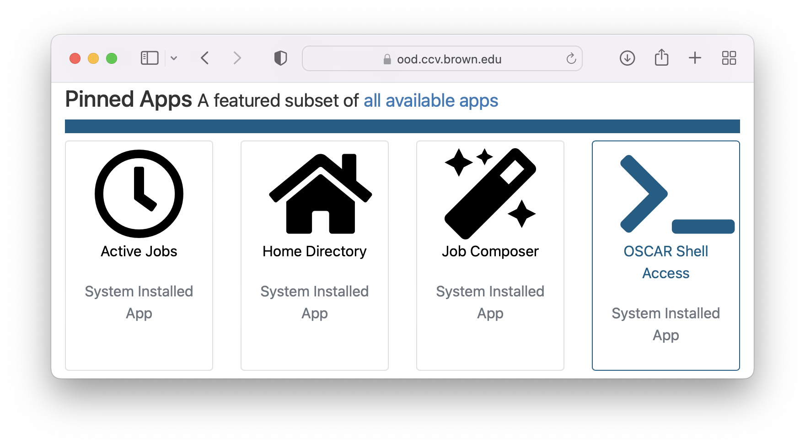

# CCV Bootcamp Python

This repository contains Jupyter notebooks for a workshop by the for the [CCV Bootcamp]
(https://docs.ccv.brown.edu/bootcamp-2023/schuedule/wednesday-5-may-1), around an introduction 
to Python and data wrangling with Python. 

# Authors

Ellen Duong, George Dang, and John Holland

It was adapted from previous CCV's annual 
[summer Python workshop](https://github.com/brown-ccv/workshop-python-2020) and 
[Bootcamps](https://github.com/brown-ccv/ccv-bootcamp-python).

# Contact

For assistance, use the CCV-Share Slack channel for today's workshop: 
https://ccv-share.slack.com/archives/C0562DCNCD7

# Get Started with the project

This workshop will run on Jupyter Notebooks. If you're using Brown University Open On Demand, 
you need to:

- clone the repository using the "OSCAR Shell Access" app
- load the notebooks using the "Basic Jupyter Notebook with Anaconda" app

## Clone the Repo

Navigate to [ood.ccv.brown.edu](https://ood.ccv.brown.edu) and log in.

Select the Oscar Shell Access App:


Then run the following commands. First, load the necessary modules:
```bash
module load "anaconda/2022.05"
```

Activate the conda environment:
```bash
conda activate /gpfs/data/bootcamp-python/venv
```

The prompt will change, to look something like: 
`(/gpfs/data/datasci/bootcamp-python/venv) [userid@login006 ~]$`

Login to GitHub by calling:
```bash
gh auth login
```

- At the prompts, select:
    - "? What account do you want to log into?" `GitHub.com`
    - "? What is your preferred protocol for Git operations?" `HTTPS`
    - "? Authenticate Git with your GitHub credentials?" `Y`
    - "? How would you like to authenticate GitHub CLI?" `Login with a web browser`

- At the prompt "! First copy your one-time code:" copy your one-time code which looks like `AB12-34CD`.
- At this point, don't press `Enter`. Instead, open a new tab in your web browser and navigate to [https://github.com/login/device](https://github.com/login/device)
- There, paste the one-time code.
- On the next page, select `Authorize github`.
- Follow any other prompts to complete your login.
- Return to the Oscar window and press enter. There may be an error or a delay, but eventually the Oscar prompt will return (if this takes longer than about a minute, ask for assistance).

Clone the repository using the command:
```bash
gh repo clone brown-ccv/ccv-bootcamp-python-2023 
```

Enter the repository directory using the command:
```bash
cd ccv-bootcamp-python-2023
```